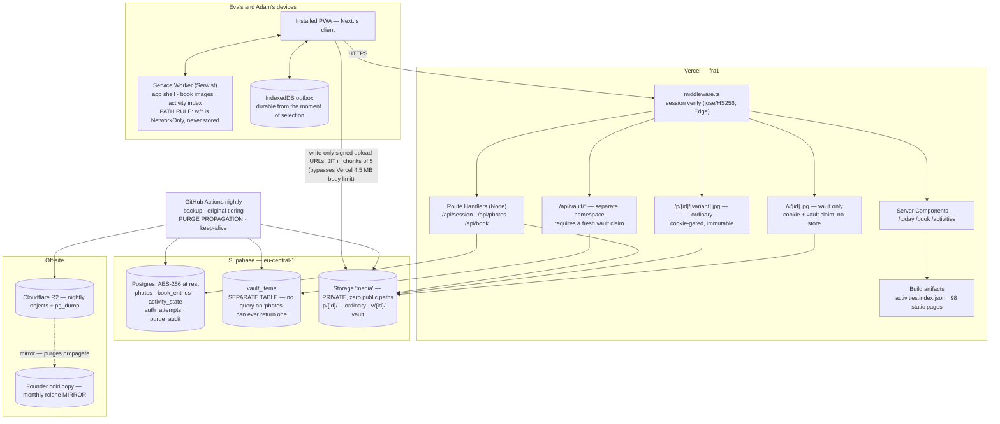

# Eva & Adam — System Architecture

**Author:** CTO · **Date:** 2026-08-02 · **Revision:** v5
**Status:** Approved-for-dispatch. **Zero founder blockers.** The storage migration remains gated on §0.7 sign-off.
**Scope:** Private PWA for one couple — Eva (New York, `America/New_York`) ↔ Adam (Israel, `Asia/Jerusalem`).
**Companion docs:** CPO product spec (D1–D3, AC-24→AC-32), Design-Lead interaction spec, CBO cost model at `docs/04-features/LDR-APP-COST-MODEL.md`, `docs/10-activity-library/library.json`, `docs/08-agents_work/handoffs/2026-08-02-research-lead-ldr-dispatch-packet.md`.

**Design posture:** two users, forever. Optimise for *simplicity, low operating cost, and durability of their photos* — in that order — except where durability or safety conflicts, in which case those win.

**Revision history**
- **v1** — first architecture. Proposed a fixed 08:00 UTC couple-day anchor.
- **v2** — private content confirmed; adopted CPO's local-date shared day, reversing my own anchor; tally made monotonic; visit countdown cut.
- **v3** — day-model reconciliation computed and reported (§3.8). Private content restructured into a **physically separate vault** (§5.5) per CPO D1. HEIC confirmed as the default case and batch upload specified (§5.9).
- **v4** — CEO's final day-model ruling applied and closed. Region, backup target and encryption posture confirmed. **Hosted dates sized and specified (§3A).** Seam toggle re-anchored to each person's local midnight per the CEO's retraction. Free-tier pause risk, OPFS, `storage.persist()`, the notification rule and the device floor absorbed. **Dispatch plan re-cut: 19 tasks, 8 waves.**
- **v5** — **this revision.** Separate vault passphrase **approved** and its two requirements turned into boot-time and test-time assertions (§5.6, §6.4). **iOS 26 confirmed as the floor on both devices** — page-turn moves to `animation-timeline` and T9 re-derived down to ~1 worker-day (§8.1), with an explicit statement of what iOS 26 did *not* fix. **External liveness monitoring outside GitHub's failure domain** (§5.8b) after GitHub's auto-disable policy was verified. **Partner presence lifted out of the dates engine into `lib/shared-day/`** (§3.10) — one function, three surfaces.

---

## §0 — Decisions required before any code

| # | Decision | Status | Detail |
|---|---|---|---|
| 0.1 | **Supabase region** | **CONFIRMED — `eu-central-1` (Frankfurt)** | Irreversible. Full reasoning recorded in [ADR-001](adr/ADR-001-supabase-region.md). Deciding argument is **jurisdiction, not latency**: the book is offline-first so page turns never touch a server, which removes latency as the deciding factor and leaves EU data residency — a genuine advantage for intimate content. Vercel functions pinned to `fra1`. |
| 0.2 | **Shared day = per-person local-date stamping** | **CONFIRMED — CEO final ruling** | My 08:00 UTC anchor is retired and recorded as the rejected alternative with its derivation intact (§3.3, §3.8). Closed; see §3.9 for the deciding test. |
| 0.3 | **Originals are not the system of record** | **CONFIRMED** | The app stores a display derivative; the untouched original stays in each camera roll. The app *is* the system of record for captions, ordering, dates and curation. |
| 0.4 | **Platform encryption at rest, not E2E** | **CONFIRMED — CEO ruled, not escalated** | E2E keyed off a shared password gives no protection against the actual threat (a stolen password derives the same key) while adding a way to lose the photos permanently — R1. The boundary is designed in (§5.5) so it can be added later. |
| 0.5 | **Off-site backup: Cloudflare R2** | **CONFIRMED — automated mirror** | Chosen because **zero egress means a restore costs nothing**, and the moment you need a restore is the worst moment to discover it is expensive. **Two properties are structurally enforced, not documented: it is a MIRROR (purges propagate within 24 h), and it uses the Standard storage class** — Infrequent Access carries a $0.01/GB retrieval charge that would quietly destroy the restore-costs-nothing property that justified the choice. §5.8, T11. |
| 0.6 | **Separate vault passphrase** | **CONFIRMED — founder approved** | A second secret, genuinely distinct from the app password. **The app password opens the book; the vault passphrase opens the vault.** Two binding requirements in §5.6: it must be *independently generated* — not derived from the app password, not a suffix, no shared salt — and **entering it must never be a step on the way to anywhere else.** This materially improves §6.4: a password thief now reaches the ordinary photos and not the private ones. |
| 0.7 | **Storage migration sign-off** | **OPEN — founder gate on T2** | Founder approves `supabase/migrations/*` before it runs. A gate, not a review. **The only remaining blocker of any kind.** |

---

## §1 — Architecture overview

### 1.1 Shape

A single Next.js 16 App Router application on Vercel. No separate backend, no queue, no cron beyond one GitHub Actions job. Supabase provides Postgres + Storage only — **not** Supabase Auth in Phase 1. English only, `dir="ltr"` fixed, no i18n framework and no bidi handling anywhere.

Five surfaces: `/today` (daily paired spread), `/book` (page-turning photo book), `/activities` (the 98-activity library), `/dates` (hosted dates — §3A), `/vault` (private, separately gated — §5.5).

**The system has exactly one scheduled job**, and it computes nothing: a nightly GitHub Action that backs up, propagates purges, and keeps the free-tier project from pausing. Everything that looks like it needs a timer — the days-together count, date fade, daily-pair completion — is a pure function of stored rows plus `now()`. This is now doubly load-bearing: **a backgrounded iOS PWA is off, not asleep**, so client-side scheduled work does not exist on this platform. If any implementation grows a background worker for one of those three, something has been misread.

### 1.2 Diagram



### 1.3 Data flow — posting to the daily exchange

1. Photo picked from the native iOS photo picker. **Nothing leaves the device yet.**
2. Client reads EXIF `DateTimeOriginal`, then decodes → canvas → re-encodes to JPEG. **The canvas re-encode is the EXIF strip** (§5.3).
3. Client writes to the IndexedDB outbox with its own `client_uuid` **before any network call**.
4. `POST /api/photos/upload-url` → server verifies the session, allocates `photo_id`, returns write-only signed URLs (2 min TTL).
5. Client `PUT`s directly to Supabase Storage. **No photo bytes traverse Vercel.**
6. `POST /api/photos` with metadata. Server resolves the timezone (§3.6), computes `shared_day`, inserts with `ON CONFLICT (client_uuid) DO NOTHING`.
7. Outbox entry cleared only on 2xx.
8. Any failure leaves the item queued and visible. Retry on `online`, on `visibilitychange → visible`, and on next launch. **iOS has no Background Sync — retry happens when the app is next opened, and the UI says so in words.**

`client_uuid` is the idempotency key end to end. A double flush cannot duplicate a photo.

---

## §2 — Data model

All timestamps are `timestamptz` (UTC). **No column ever stores a numeric UTC offset.**

### 2.1 Tables

```sql
-- ── members ────────────────────────────────────────────────
-- Exactly two rows. Slugs are NAMES, not 'a'/'b' — the library's couple.a/couple.b
-- ordering (Adam first) is the opposite of the product name ordering (Eva first),
-- and an index-style slug is exactly how a wrong-attribution bug gets written.
create table members (
  id            uuid primary key default gen_random_uuid(),
  slug          text not null unique check (slug in ('eva','adam')),
  display_name  text not null,
  home_timezone text not null,          -- eva: 'America/New_York' · adam: 'Asia/Jerusalem'
  created_at    timestamptz not null default now()
);

-- ── photos ─────────────────────────────────────────────────
-- NOTE: there is deliberately NO `sensitivity` column. If a row is in this table,
-- it is not private. See §5.5 — private content lives in a different table so that
-- no query here can ever return it, whether or not its author remembered to filter.
create type photo_kind as enum ('daily','book');

create table photos (
  id                    uuid primary key,
  client_uuid           text not null unique,
  kind                  photo_kind not null,
  author_member_id      uuid not null references members(id),
  attribution_source    text not null default 'self_declared'
                          check (attribution_source in ('self_declared','authenticated')),

  -- the day model (§3); these three together make shared_day reproducible forever
  shared_day            date not null,
  shared_day_tz         text not null,
  client_reported_tz    text,

  taken_at              timestamptz,
  caption               text,

  storage_path_display  text not null,   -- p/{id}/display.jpg
  storage_path_thumb    text not null,   -- p/{id}/thumb.jpg
  storage_path_original text,
  original_location     text not null default 'none'
                          check (original_location in ('none','supabase','r2','purged')),

  width  int not null check (width  > 0),
  height int not null check (height > 0),
  bytes  int not null check (bytes  > 0),
  mime   text not null check (mime = 'image/jpeg'),
  color_space text not null default 'srgb' check (color_space in ('srgb','display-p3')),
  checksum_sha256 text not null,
  exif_stripped   boolean not null default true,

  created_at         timestamptz not null default now(),
  deleted_at         timestamptz,
  purge_requested_at timestamptz,
  purged_at          timestamptz
);

create index photos_shared_day_idx   on photos (shared_day desc)              where deleted_at is null;
create index photos_kind_created_idx on photos (kind, created_at desc)        where deleted_at is null;
create index photos_author_day_idx   on photos (author_member_id, shared_day) where deleted_at is null;
create index photos_purge_queue_idx  on photos (purge_requested_at)           where purged_at is null;

-- One photo each per shared day (CPO: "one photo each, paired on a spread").
-- A re-post soft-deletes the prior row, so the index stays satisfied and the
-- replacement reads as "use this one instead" rather than as an error.
create unique index photos_one_daily_per_member_per_day
  on photos (author_member_id, shared_day)
  where kind = 'daily' and deleted_at is null;

-- ── vault_items ────────────────────────────────────────────
-- Physically separate: own table, own storage prefix, own routes, own repository
-- module. No thumbnail variant is EVER generated for a vault item (§5.5).
create table vault_items (
  id                   uuid primary key,
  client_uuid          text not null unique,
  author_member_id     uuid not null references members(id),
  shared_day           date not null,
  shared_day_tz        text not null,
  taken_at             timestamptz,
  caption              text,
  storage_path_display text not null,     -- v/{id}/display.jpg — display variant ONLY
  width int not null, height int not null, bytes int not null,
  mime  text not null check (mime = 'image/jpeg'),
  checksum_sha256 text not null,
  exif_stripped   boolean not null default true,
  created_at         timestamptz not null default now(),
  deleted_at         timestamptz,
  purge_requested_at timestamptz,
  purged_at          timestamptz
);
create index vault_items_created_idx on vault_items (created_at desc) where deleted_at is null;

-- ── book_entries ───────────────────────────────────────────
-- A page is EITHER a photo OR a finished date's artifact — never both, never neither.
-- References photos only; structurally cannot reference a vault item.
create table book_entries (
  id uuid primary key default gen_random_uuid(),
  photo_id uuid references photos(id),
  date_id  uuid references dates(id),
  position numeric not null,              -- fractional index: a reorder writes one row
  caption text,
  date_label text,
  created_at timestamptz not null default now(),
  deleted_at timestamptz,
  constraint book_entry_is_photo_xor_date
    check ((photo_id is null) <> (date_id is null))
);
create unique index book_entries_photo_idx on book_entries (photo_id) where deleted_at is null and photo_id is not null;
create unique index book_entries_date_idx  on book_entries (date_id)  where deleted_at is null and date_id  is not null;
create index book_entries_position_idx     on book_entries (position) where deleted_at is null;

-- ── dates (the hosted-date subsystem — §3A) ────────────────
-- One engine, three kinds. Words 'failed', 'abandoned' and 'expired' are BANNED
-- from this codebase; CI greps for them. A date that stops is 'faded', which is
-- derived from inactivity and never written by a job.
create type date_kind   as enum ('story','twenty_questions','paired_question');
create type date_status as enum ('open','finished','faded');

create table dates (
  id            uuid primary key default gen_random_uuid(),
  kind          date_kind   not null,
  status        date_status not null default 'open',
  started_by    uuid not null references members(id),
  -- Hidden state for asymmetric kinds. NEVER selected by the ordinary session
  -- query; only lib/data/dates.ts returns it, and only to secret_holder_id.
  secret        jsonb,
  secret_holder_id uuid references members(id),
  config        jsonb not null default '{}'::jsonb,
  created_at    timestamptz not null default now(),
  finished_at   timestamptz,
  check ((secret is null) = (secret_holder_id is null))
);
create index dates_status_idx on dates (status, created_at desc);

create table date_turns (                  -- append-only; a turn is never edited or deleted
  id         uuid primary key default gen_random_uuid(),
  date_id    uuid not null references dates(id),
  member_id  uuid not null references members(id),
  seq        int  not null,
  turn_kind  text not null default 'turn' check (turn_kind in ('turn','guess','reveal')),
  body       text not null,
  created_at timestamptz not null default now(),
  unique (date_id, seq)
);
create index date_turns_date_seq_idx on date_turns (date_id, seq desc);

-- ── activity_state / activity_log ──────────────────────────
-- activity_id is a text key into the static library. NO foreign key, by design (§4.1).
create table activity_state (
  activity_id text primary key,
  status text not null default 'none' check (status in ('none','saved','done','hidden')),
  rating smallint check (rating between 1 and 5),
  times_done int not null default 0,
  last_done_at timestamptz,
  notes text,
  library_version text not null,
  updated_at timestamptz not null default now()
);

create table activity_log (
  id bigserial primary key,
  activity_id text not null,
  member_id uuid references members(id),
  occurred_at timestamptz not null default now(),
  window_id text,                          -- 'w1'..'w9'
  note text
);
create index activity_log_activity_idx on activity_log (activity_id, occurred_at desc);

-- ── auth_attempts / purge_audit / app_settings ─────────────
create table auth_attempts (
  id bigserial primary key,
  ip inet, user_agent text,
  scope text not null default 'session' check (scope in ('session','vault')),
  ok boolean not null,
  at timestamptz not null default now()
);
create index auth_attempts_ip_at_idx on auth_attempts (ip, at desc);
create index auth_attempts_at_idx    on auth_attempts (at desc);      -- 30-day retention

create table purge_audit (                 -- append-only; survives the content it describes
  id bigserial primary key,
  item_id uuid not null,
  item_table text not null check (item_table in ('photos','vault_items')),
  requested_at timestamptz not null,
  supabase_purged_at timestamptz,
  r2_purged_at timestamptz,
  requested_by text not null,              -- member slug, self-declared
  ip inet
);

create table app_settings (
  key text primary key, value jsonb not null,
  updated_at timestamptz not null default now()
);
```

**Deleted from earlier revisions:** `pauses` (the tally no longer breaks), the `sensitivity` enum and column (replaced by structural separation), and any visit-countdown schema (feature cut).

### 2.2 The `shared_day` guarantee

```sql
create or replace function shared_day_of(ts timestamptz, tz text)
returns date language sql immutable
as $$ select (ts at time zone tz)::date $$;
```

A trigger on both `photos` and `vault_items` rejects any row where the app-supplied `shared_day` disagrees with `shared_day_of(created_at, shared_day_tz)`. Storing `shared_day_tz` beside the value makes the label **reproducible forever** — it can be re-derived years later independent of who posted it or where they live then. This is the one column whose silent corruption would be permanent and unauditable, so it gets both an app computation and a database check. Postgres ships full tzdata, so SQL and TypeScript agree; golden tests assert it (P1-T6).

### 2.3 The tally — derived, and nothing can decrement it

```sql
-- Display view: what the UI shows for a day. Excludes soft-deleted.
create view v_shared_days as
select p.shared_day,
       bool_or(m.slug='eva')  as eva_posted,
       bool_or(m.slug='adam') as adam_posted,
       bool_or(m.slug='eva') and bool_or(m.slug='adam') as both_posted,
       count(*) as photo_count,
       min(p.created_at) as first_post_at,
       max(p.created_at) as last_post_at
from photos p join members m on m.id = p.author_member_id
where p.kind='daily' and p.deleted_at is null
group by p.shared_day;

-- Tally view: counts that they SHOWED UP. A soft delete or a re-post does not
-- erase the historical fact; only a permanent purge does, because a purged photo
-- genuinely never existed.
create view v_days_together as
select p.shared_day
from photos p join members m on m.id = p.author_member_id
where p.kind='daily' and p.purged_at is null
group by p.shared_day
having bool_or(m.slug='eva') and bool_or(m.slug='adam');
```

`days_together = count(*) from v_days_together`.

**Confirming CPO's D3 explicitly:** there is no counter column, no break job, no grace ledger, no decay timer, and no scheduled task anywhere in this architecture that can mark anything lost. The number is a `count(*)` over an aggregate. Nothing decrements it.

The one place a decrement could have crept in is deliberately closed: the tally filters on `purged_at`, **not** `deleted_at`, so deleting or replacing a photo later cannot retroactively erase a day they both showed up for. Had it used `deleted_at`, tidying up an old photo would silently reduce "days together" — a decay path by accident. Flagged for CPO in §11 in case the intent differs.

### 2.4 Storage layout

One bucket, `media`, **private, zero public paths**, with two prefixes mirroring the table separation:

```
p/{photoId}/display.jpg     1600 px long edge, q0.82   ~250–400 KB
p/{photoId}/thumb.jpg        400 px long edge, q0.75   ~25–40 KB
p/{photoId}/orig.{ext}       untouched bytes — transient, tiered to R2 nightly

v/{vaultItemId}/display.jpg  vault. Display variant ONLY — no thumbnail exists.
v/{vaultItemId}/orig.{ext}   transient, tiered to R2 nightly
```

The prefix split is what lets the service worker exclude vault content by **path** rather than by response header (§7.2) — a rule a header regression cannot defeat.

### 2.5 RLS posture

Per `supabase-rls-conventions`: **RLS enabled on every table, zero policies — deny-all.** No client holds a Supabase key in Phase 1; all access is server-side with the service role, which bypasses RLS. Deny-all is defence in depth: a leaked anon key grants nothing. Phase 2 adds `auth.uid()`-keyed policies without touching a column.

---

## §3 — The shared-day model (flagship decision)

### 3.1 The problem

For 7 hours of every day — 6 hours for 26 days a year (§3.5) — Eva and Adam are on different calendar dates. Their largest shared window, **W1 (IL 05:00–09:00 ↔ NYC 22:00–02:00), straddles New York midnight.** Their second, W5, straddles Israeli midnight. Every couple app on the market either ignores this or picks one partner's clock and quietly penalises the other.

### 3.2 The decision — CPO's local-date shared day

> **Shared day `D` opens at 00:00 in Israel and closes at 23:59:59 in New York.**
> **Each partner contributes during their own local date `D`.**
> **A day is complete when both have contributed. Evaluation resolves at New York midnight. Neither partner can ever be late.**

Storage: `shared_day = (created_at AT TIME ZONE <author's zone>)::date`, with the zone stored beside it.

Every photo carries the date that was on the poster's own wall calendar. That is the only labelling either of them ever has to reason about, and it is correct for both simultaneously. Because New York is behind, Eva's day D closes last, which is what makes "nobody can be late" true rather than aspirational.

Measured against the 2026 tz database:

| Property | Value |
|---|---|
| Shared-day length | **31 h on 339 days, 30 h on 26 days.** Never anything else. |
| Consecutive days overlap by | 7 h (6 h in the shoulder periods) |
| Well-ordered (`close > open`) every day of 2026, including all four DST transitions | **Yes** |
| Requires a scheduled job | **No** — §3.4 |

### 3.3 Pair binding — CEO item 4, confirmed

**Guaranteed by construction, in either order, at any separation.** The pair binds on the stored `shared_day` label — not on time proximity, arrival order, or a window. Verified at the extremes:

| Case | Adam | Eva | Both bind to D? |
|---|---|---|---|
| Maximum separation, Adam first | IL D 00:00:01 (= UTC D−1 21:00) | NYC D 23:59:59 (= UTC D+1 03:59) | **Yes — 31 h apart** |
| Maximum separation, Eva first | IL D 23:59:59 | NYC D 00:00:01 | **Yes — Adam posts 17 h before Eva's day even begins** |

The daily spread is `SELECT … WHERE kind='daily' AND shared_day = D` — one row per member, enforced by the unique index in §2.1. There is no ordering assumption anywhere in the query, so "who posted first" is not a concept the data model has.

**The one honest caveat:** during a live W1 session the two are on different local dates (at NYC Sunday 22:00, Eva is on Sunday while Adam is already on Monday — verified). Two photos posted in the same minute of that conversation would carry adjacent labels. This does not affect pair binding for the daily exchange, since completion only requires each person to post *somewhere* in their own 24 hours. It affects only the label on a photo posted mid-session.

### 3.4 The tally — it only counts up

```
days_together = the number of shared days D on which BOTH partners contributed
                at least one kind='daily' photo stamped with their own local date D.

  • A missed day is simply not counted. No reset, no decay, no grace ledger,
    no consecutive-run state, no scheduled job that can mark anything lost.
  • An aggregate over contribution records — always recomputable, cannot be
    corrupted into a wrong value.
  • A day is PENDING (never "missed") until New York midnight passes.
```

"Streak" is retired as a term in code — it implies a consecutiveness the model no longer has. The domain term is `daysTogether`.

**D3 compliance, stated for the record:** the grace mechanism, `streak_grace_per_week`, the `pauses` table and every break condition were deleted in v2 when D3 landed — they existed only in v1. Nothing in the current schema, views or task list can decrement or reset. A visit needs no pause: during one, days simply aren't complete, so there is nothing to suspend. The instinct to compute from a view rather than store a counter is what survived, and it is what makes this checkable rather than trusted.

**"Evaluation at New York midnight" needs no scheduled job.** Completion is a pure function of the rows plus `now()`: complete when both rows exist, pending until `NYC D 24:00` passes. Nothing is written on a timer, so there is no cron, no Inngest, and no drift between what a job computed and what the data says.

### 3.5 DST

| Period | Israel | New York | Gap | Shared day |
|---|---|---|---|---|
| 1 Jan – 8 Mar | UTC+2 | UTC−5 | 7 h | 31 h |
| **8 Mar – 27 Mar** | UTC+2 | UTC−4 | **6 h** | **30 h** |
| 27 Mar – 25 Oct | UTC+3 | UTC−4 | 7 h | 31 h |
| **25 Oct – 1 Nov** | UTC+2 | UTC−4 | **6 h** | **30 h** |
| 1 Nov – 31 Dec | UTC+2 | UTC−5 | 7 h | 31 h |

**26 days a year the gap is 6 hours.** Every window in `library.json` shifts by an hour on those days, and on a transition day one partner's own local day is 23 or 25 hours long — which the local-date model absorbs without special-casing, because `(ts AT TIME ZONE zone)::date` is correct by construction.

Hard rules:
- **No numeric offset appears anywhere in the codebase** — not `+3`, not `−4`, not `8`, not in a constant, a config file or a test fixture. Zones are IANA strings. (§3.8: a stray `−8h` would silently reintroduce the retired model.)
- Window clock ranges are rendered from IL local hours via `Intl`, never stored as UTC ranges.
- **Golden test set is mandatory (P1-T6):** 7/8/9 Mar, 26/27/28 Mar, 24/25/26 Oct, 31 Oct, 1/2 Nov 2026 — each at IL and NYC 23:59/00:00/00:01 — asserting the label, the 30/31 h length, well-ordering, and **that TypeScript and Postgres return identical values**.

### 3.6 Timezone resolution — and the attribution coupling

1. `client_reported_tz` from `Intl.DateTimeFormat().resolvedOptions().timeZone`, if a valid IANA id.
2. Otherwise `members.home_timezone`.

Whichever is used is stored in `shared_day_tz`.

- **This handles visits for free.** When Eva is in Israel her device reports `Asia/Jerusalem`, the gap collapses, and the shared day becomes an ordinary 24-hour day with no special case. This is why the deleted `pauses` table is not missed.
- **Attribution touches correctness here.** If the "who am I?" picker is wrong *and* the device zone is unavailable, the fallback picks the wrong home zone. Mitigation: when `client_reported_tz` matches the *other* member's home zone, ask for a one-line confirmation rather than guessing silently.

### 3.7 UI obligations

Architectural requirements; Design-Lead owns their appearance.

1. **`/today` always shows *your own* local date.** If their day D hasn't started yet, their side of the spread reads "Sunday hasn't started in New York yet" — never an empty accusatory box.
2. **Dual date chip** wherever the two dates differ: `Sun 2 Aug — Tel Aviv · Sat 1 Aug — New York`, collapsing when they agree. `Intl.DateTimeFormat(locale, { timeZone })`; no timezone library.
3. **Partner-clock line** on the daily exchange, always.
4. **Pending, never late.** No countdown, no red state, no nag.
5. **Never render a bare weekday** without dual-date context during the overlap hours.
6. **A "post to the other day" toggle, anchored at each person's own local midnight.** Not a correctness mechanism — under local-date stamping, correctness is structural. It exists for two ordinary human cases: *"it's 00:30 but this is still Tuesday night to me"*, which is the seam people actually feel; and **a photo posted mid-flight or with a stale device timezone**, which is a real case for this couple precisely because preferring the device zone (§3.6) is what makes visits work. Never load-bearing.

> **Retracted from earlier drafts:** the ±2 h seam affordance around a fixed anchor. That flaw belonged to the 08:00 UTC model — a fixed window around IL 10:00/11:00 missed Adam's 05:00–08:00 morning, and DST would have shifted the window underneath us anyway. Under local-date stamping his morning files under his own date by construction, so the flaw dissolved with the model that had it. There is nothing there to fix, and widening a moving window would have been the wrong repair.

### 3.8 Reconciliation — CEO item 7. Verdict: **THEY DIVERGE**

CPO specced a 31-hour couple-day opening 00:00 Israel; I anchored v1's couple-day at 08:00 UTC. The CEO was right to demand this be checked rather than assumed. **They are not the same concept expressed differently.** Measured minute-by-minute across all of 2026:

| | Model A — CPO (author's local date) | Model B — CTO v1 (08:00 UTC anchor) | **Disagreement** |
|---|---|---|---|
| **Adam** (Asia/Jerusalem) | rolls at IL 00:00 | rolls at IL 10:00 (winter) / 11:00 (summer) | **44.1% of the year** — every day, during his local 00:00–10:00/11:00 |
| **Eva** (America/New_York) | rolls at NYC 00:00 | rolls at NYC 03:00 (EST) / 04:00 (EDT) | **15.2% of the year** — every day, during her local 00:00–03:00/04:00 |

Per regime: Adam 44.3% at a 7 h gap and 41.7% at 6 h; Eva 15.1% and 16.5%. **The divergence is not a DST edge case — it is structural and it happens every single day.** DST changes only the width of the disagreement band, by an hour.

**Concretely:** a photo Adam posts at IL Saturday 08:00 is labelled *Saturday* by CPO's model and *Friday* by mine. If both models existed in one codebase — TypeScript using one, SQL or a later contributor using the other — roughly a third of all posts would be silently mislabelled, the daily spread would pair the wrong photos, and nothing would throw an error. This is exactly the silent schema-level mismatch the CEO was looking for.

**Verdict and action:**
- **CPO's model is adopted; mine is retired.** I reversed this in v2 on the merits, before the reconciliation was requested — the anchor mislabels Adam's local 00:00–10:00, reintroducing the "being late" failure CPO's model exists to prevent. §3.3 records the reasoning.
- **The retired model must not survive anywhere.** The 08:00 anchor appears in no table, function or test. §3.5's ban on numeric offsets is what enforces this: a stray `- interval '8 hours'` or `-8` in date arithmetic is the specific regression that would resurrect it, and P1-T6's golden set is the tripwire that catches it.
- **Nothing else in the architecture depended on the anchor.** It was confined to `shared_day` derivation; no downstream section changes as a result of the reversal.

### 3.9 Closed — the deciding test

The CEO's final ruling names the test that settles it, and it is recorded here so nobody re-derives the argument:

> **Can a photo ever land on a shared day that is already complete?**

**Per-person local-date stamping: no, never.** Each person has exactly one local date at every instant, in every regime — NY fall-back repeats 01:00–02:00 and the date is the same both times; spring-forward skips 02:00–03:00 and the date is still unambiguous. There is no instant where the rule is undefined or doubled, which is the property that makes it DST-proof.

**The 08:00 UTC anchor: yes, every morning of Adam's life** unless he remembered a toggle. A correctness property that depends on a person remembering something at 5am is not a correctness property. That is the disqualifying reason, and it is why the anchor lost despite its own DST-immunity being real.

**This is closed.** It re-opens only on a concrete case, with timestamps, where local-date stamping lands a photo on a completed day.

### 3.10 Partner presence — one function, three surfaces

Every turn-based product on the market says *"waiting for your opponent"* and greys the board. **This app already knows, to the minute, that the other person is asleep.** The idle state is not a blocked state — it is information: *"Eva's asleep. It's 3:40 in the morning there."*

This needs no new mechanism. The inputs already exist: `members.home_timezone`, `Intl`, and the couple's work weeks from `library.json` (`couple.a.work_week` = Sun–Thu, `couple.b.work_week` = Mon–Fri). So it lives in `lib/shared-day/presence.ts` (T6), not in the dates engine:

```ts
partnerPresence(memberId, at = new Date()): {
  localTime: string;              // rendered via Intl in their zone
  localDate: string;
  presence: 'asleep' | 'working' | 'awake' | 'unknown';
  window: WindowId | null;        // w1..w9 when the moment falls in a known window
}
```

**Three surfaces consume it, which is why it does not belong to dates:** the partner-clock line on `/today` (§3.7 item 3), the "their day hasn't started yet" empty state, and the dates engine's waiting state. Building it inside T14a would have meant reimplementing it for the first two.

**`presence` is an inference and is typed to say so.** It is derived from local hour bands plus the work week — it is not a signal from their device, and nothing reports "last seen". `'unknown'` is a real value and the UI must render it rather than guessing. The honest version — *"it's 3:40am there"* — is stronger than a claim we cannot support, and it is the true thing the generic version was hiding.

It is a pure function of stored rows plus `now()`, like everything else in §1.1. No presence table, no heartbeat, no job.

**Contract requirement on T14a:** `GET /api/dates/{id}` returns whose-turn **and** the waiting partner's presence together, in one response. A UI cannot say the true thing if it has to make a second call to find out whether the other person is asleep.

---

## §3A — Hosted dates

The activities become playable inside the app, and they are called **dates**. CPO cut Phase 1 to three, chosen to share one interaction shape: **alternating short-text turns, no timer, resumable indefinitely, ending by writing a page into the book.**

### 3A.1 Does one engine genuinely serve all three?

Asked plainly because the whole selection rationale depends on the answer. **Two of the three collapse into one engine. The third does not — it is cheaper than that.**

| | The story (Fortunately/Unfortunately) | Twenty questions | The paired question |
|---|---|---|---|
| Turn rule | strict alternation | strict alternation | **not turn-based at all** |
| Roles | symmetric | **asymmetric** — holder / asker | symmetric |
| Hidden state | none | **a secret only one side may see** | none |
| Termination | someone ends it, or a turn cap | correct guess, or the count runs out | both have answered |
| Artifact | the finished story *is* the page | the secret + the question trail | the pair |
| **Runs on** | **the dates engine** | **the dates engine** | **the daily-pair engine, already being built** |

**The paired question is not a date in the engine sense.** It is the daily photo pair with text instead of an image — same `shared_day` completion logic, same "neither can be late" property, same pending semantics. Building it on the dates engine would be the more expensive mistake. It reuses T10.

**The story and twenty questions do share one engine**, and the shared part is the substantial part: session state, an append-only turns table, whose-turn derivation, resumability across a 7-hour gap, fade, and the artifact write into the book. Per-kind code is three small pure functions plus one view fragment:

```ts
// lib/dates/kinds/<kind>.ts — the entire per-kind surface
turnRule(session, turns): { nextMemberId: string | null }
isFinished(session, turns): boolean
renderArtifact(session, turns): BookPage
```

**The honest caveat, so "built once" isn't oversold:** twenty questions adds a **hidden-state visibility rule** — the secret must be readable by exactly one member. That is one conditional in one repository function, but it is a *security-shaped* conditional in the same class as the vault, just at lower stakes, and it gets a test rather than a review. Plus an asymmetric view fragment. Call it **20–25% on top of the story, not a second implementation.** If it ever becomes three bespoke date UIs, the selection rationale has been thrown away and the review should say so.

### 3A.2 Sizing

A worker-day here means one focused agent task taken to green — typechecked, linted, tested, session file written.

| Task | Scope | Worker-days |
|---|---|---|
| **T14a** — dates engine, backend | `dates` + `date_turns` schema, `book_entries` change, `lib/data/dates.ts`, turn/whose-turn/fade derivation, artifact write, `/api/dates/*`, hidden-state rule | **1.5** |
| **T14b** — dates engine, frontend + the story | `/dates` list, open-date view, turn composer, story kind module, artifact preview | **1.5** |
| **T15** — twenty questions | asymmetric roles, secret holding, question count, guess/reveal turn kinds | **1.0** |
| **T16** — the paired question | rides the daily-pair path; a text variant of the `/today` slot | **0.5** |
| | **Total** | **4.5 worker-days across 4 tasks** |

**Phase 1 is still deliverable.** This takes the plan from 14 tasks to 19 (dates + the device-verification task + the keep-alive folded into T11) and adds **one wave** to the critical path. It does not touch anything already specced except `book_entries`, which is why it needed to land before T2 runs rather than after.

### 3A.3 No Realtime in Phase 1 — and the reason is not cost

Cost is verified as a non-issue (200 concurrent connections, 2M messages/month on the free tier; two people taking turns across seven hours will not approach either). **The objection is a design one and it stands independently:** the median gap between turns in this product is measured in *hours*. A persistent websocket, a subscription lifecycle and reconnection handling are real complexity bought to shorten a latency nobody is waiting on. A `GET` on focus plus `visibilitychange` covers it exactly, works offline-degraded, and has no lifecycle.

Realtime remains the right tool the moment a date is genuinely simultaneous — co-drawing, a synchronised reveal. It is free and available; we are simply not paying complexity for it now.

### 3A.4 Fade — derived, never scheduled

```
A date is FADED when status='open' and max(date_turns.created_at) < now() - 30 days.
```

Computed on read, exactly like the days-together count. **No job marks anything faded.** `status` on the row moves only to `'finished'`, and only by an explicit action; `'faded'` is a derivation the read layer applies. This is the third of the three mechanisms that look like they need a scheduler and do not — see §1.1.

An open date awaiting your turn outranks a new suggestion in the `/dates` ordering. That ordering is a `CASE` in one query, not a notification.

**Vocabulary is enforced, not requested:** `failed`, `abandoned` and `expired` are banned identifiers. CI greps the diff for them and fails the build. A word that never appears in the schema cannot leak into a UI string.

### 3A.5 Hard boundaries — what must never be hosted

Two categories are excluded by architecture, not by backlog priority:

1. **The T5 evidence-based protocols — 36 Questions, Imago, Hold Me Tight, Dreams Within Conflict — must never be hosted as async dates.** The research states they are contraindicated *by truncation*: stopping mid-protocol is worse than never starting. An async host with a 30-day fade converts the protocol's core mechanic directly into its documented failure mode. They stay as library entries with instructions, run live, never as a session with a resume button.
2. **Mature third-party async games are not rebuilt.** Correspondence chess exists, is excellent, and handles the 7-hour gap better than anything we would ship in a week. The library links to them; the app does not reimplement them.

A `hostable: boolean` field is derived at build time from the library and is **false** for every T5 entry — the constraint is expressed in the ingest step, so a future contributor adding a "play here" button to a protocol has to defeat a build-time assertion to do it.

---

## §4 — The activity library

### 4.1 Decision: static file, not a seeded table

`library.json` ships in the repo, read **only in Server Components and the build step**. It never enters a client bundle.

**Why not seed Supabase:** the library changes rarely and wholesale (a re-run of `build_library.py`). Seeding creates a second source of truth requiring re-sync on every regeneration plus migration churn for content edits. 98 rows do not need SQL; `git diff` is a better audit trail than a migration log.

**What Supabase holds:** only user state, keyed by `activity_id` as plain text **with no foreign key** — a FK would couple content regeneration to a migration. `library_version` records the `generated` stamp so an id change can be reconciled rather than silently orphaning a rating.

### 4.2 Build-step derivatives

| Artifact | Contents | Size | Consumer |
|---|---|---|---|
| `public/activities.index.json` | 98 × slim record incl. `cost_tier`, `shareplay`, `screen_free`, `intimacy_level` | ~30 KB raw / ~9 KB gz | Client — fetched once, SW-precached, filtered in memory. Zero-latency, works offline. |
| 98 static detail routes | full record via `generateStaticParams` | static HTML | `/activities/[id]` — free on Vercel, SW-cacheable |

The full 290 KB never reaches the client.

### 4.3 Ingest normalisation — two verified hazards

The prebuild script validates the library through a Zod schema. **Any violation fails the build**, so a regenerated `library.json` cannot ship a silently mangled field.

**Hazard 1 — `apple_shareplay` is tri-state across two JSON types.** Verified: `false` (73), `"unknown"` (16), `true` (9).

```ts
// A naive Boolean(x) coerces the string "unknown" to TRUE, claiming SharePlay
// works for 16 activities where it is explicitly unverified. That is the bug.
const SharePlay = z.union([z.boolean(), z.literal('unknown')])
  .transform((v): 'yes' | 'no' | 'unknown' =>
    v === true ? 'yes' : v === false ? 'no' : 'unknown');
```

`unknown` renders as its own state ("not verified"), never merged into either boolean. A "SharePlay works" filter returns 9 activities, not 25.

**Hazard 2 — `cost` is free text, 31 distinct strings.** Verified: every value begins `free` (74), `cheap` (7) or `paid` (17); 3 of the `free` values describe a conditional paid path.

```ts
cost_tier:        'free' | 'cheap' | 'paid'   // strict prefix parse; build fails on no match
cost_conditional: boolean                      // the 3 "free … to paid …" cases
cost_note:        string                       // original string, verbatim, never discarded
```

The original text carries real detail (NIS-vs-USD pricing, which subscription is required, what was left unverified) and is shown in full on the detail page. Only the tier is used for filtering.

All other categoricals are validated as small enums: `energy_required` (3), `energy_symmetry` (3), `setup_effort` (3), `tier` (3), `category` (4), `confidence` (3), `verification_tier` (2), `novelty_curve` (3), `intimacy_level` (1–5), `screen_free` (bool), `duration_min` (int on all 98), `window_fit` (1–5 of `w1`–`w9`).

---

## §5 — Photo pipeline

### 5.1 Source of truth: the iOS photo picker

Both of them upload from their iPhone camera rolls via multi-select in the native picker. There is no import integration, no shared album, no chat export. Two consequences dominate the design: **HEIC is the default case**, and **every first-run upload is a large batch over a phone connection**.

### 5.2 HEIC — on the critical path for every upload

Whether iOS transcodes HEIC→JPEG on the way out of the picker **depends on the picker path and the device's settings, and must be measured rather than assumed**. P1-T4 ships a one-time probe that records the actual MIME type and extension received on Eva's and Adam's real devices, for both the Photos path and the Files path, and logs the result to its session file.

**The architecture is designed so the answer doesn't change correctness.** `createImageBitmap()` decodes whatever arrives; on Apple platforms the OS HEIC decoder is available, so HEIC and JPEG converge on the same canvas step. The transcode question affects only speed (a JPEG decode is faster) and whether the wasm fallback is ever needed. On non-Apple browsers, `heic2any` (~1.4 MB) loads lazily and **only** when the native decode throws.

| Variant from the picker | Behaviour |
|---|---|
| **HEIC** (expected default) | Native decode → canvas → JPEG. No extra cost on Apple devices. |
| **JPEG** (if iOS transcodes) | Same path, one step faster. |
| **Live Photo** | The picker delivers only the still frame to a file input; the motion component is not exposed. **Live Photos degrade to their still automatically — no work required.** Stated so it isn't discovered in production. |
| **Burst** | Selected frames arrive as individual files. Handled as ordinary photos. |
| **HDR / Display P3** | The canvas re-encode drops the HDR gain map, so an HDR photo will look flatter than in Photos.app. A real, visible quality loss, and the trade is accepted — a compatible JPEG is the right artifact for a web app and the untouched original is preserved. We attempt `canvas.getContext('2d', { colorSpace: 'display-p3' })` with an sRGB fallback, recording which was used in `photos.color_space`. |

### 5.3 EXIF stripping is asserted, not assumed

The canvas re-encode emits no EXIF segment, so **GPS never leaves the device** — and with camera-roll originals carrying home addresses in two countries, this is the single highest-value assertion in the suite. `exif_stripped` defaults to `true`, which is a claim; P1-T4 is not done until a test loads a real iPhone HEIC fixture *containing GPS tags*, runs the pipeline, and **parses the output bytes** to prove no APP1/EXIF segment and no GPS IFD survive.

`DateTimeOriginal` is read into a variable *before* the strip, so the capture date is preserved while everything else is discarded.

### 5.4 Serving — cookie-gated proxy (deviation **approved** by CEO)

The bucket is private with zero public paths — absolute and non-negotiable. On the **read** path we use something stricter than signed URLs. This was raised as a deviation from the "signed short-lived URLs only" instruction and **approved**; it is settled, not pending.

| | Signed read URLs | Stable cookie-gated proxy (**recommended**) |
|---|---|---|
| What the client receives | A time-limited **bearer token** in a URL | Nothing — a path useless without the session cookie |
| If the URL leaks (logs, screenshot, referrer, a shared link) | Anyone can fetch it for the TTL, unauthenticated | Nothing; the request redirects to `/login` |
| Auth checked per byte fetch | Once, at signing time | **Every request** |
| Service-worker `CacheFirst` | Breaks — the query string rotates on re-sign, so the offline book silently fails | Works — stable, immutable cache key |
| Revocation | Impossible until the TTL expires | Immediate |

Write-path signed URLs are retained (§5.9) — write-only, single-path, short-TTL URLs carry no content and are what lets photo bytes bypass Vercel's 4.5 MB limit.

The second argument was decisive independently: rotating query strings break service-worker `CacheFirst`, **which would kill the offline photo book — the entire answer to Eva's commute**, the thinnest window in the research.

```
/p/{id}/{variant}.jpg   Cache-Control: private, max-age=31536000, immutable   → SW-cacheable
/v/{id}.jpg             Cache-Control: no-store  + fresh vault claim required  → never cached
```

### 5.5 The vault — structural separation, per CPO D1

The requirement is that private items are **structurally separate, not flagged**. A `WHERE NOT private` that someone forgets once is the bug this must make impossible — so there is no boolean to forget:

| Layer | Separation |
|---|---|
| **Table** | `vault_items`, not a column on `photos`. Every ordinary query targets `photos` and **physically cannot return a vault row.** |
| **Repository** | `lib/data/vault.ts` is the only module referencing `vault_items`. `lib/data/photos.ts` — which serves the book, the daily spread, the manifest and every thumbnail — has no import path to it. |
| **Storage prefix** | `v/{id}/…` vs `p/{id}/…` |
| **Routes** | `/api/vault/*` and `/v/{id}.jpg`, a separate namespace from `/api/photos/*` and `/p/*` |
| **Service worker** | A **path rule**: `/v/*` is `NetworkOnly`. Path-based, so a header regression cannot defeat it. |
| **Thumbnails** | **No thumbnail derivative is ever generated for a vault item.** The artifact does not exist, so it cannot leak into a grid, a share sheet or a notification preview. Vault items render one at a time at display size. |
| **Book** | `book_entries.photo_id` is a FK to `photos`. A vault item cannot be added to the book — the database refuses it. |
| **Default** | Upload goes to `photos`. Reaching the vault requires choosing that surface explicitly. |
| **Access** | Fresh re-authentication (§5.6). |

Moving an item between the two is an explicit, transactional operation that inserts into the destination, moves the storage objects, and deletes from the source. There is no in-place flag flip, because a flag flip is what the whole structure exists to avoid.

**Why this matters in this product specifically:** the window model says Eva may be at a desk in an open office (W4) or on a train (W3). A private photo one page-turn from the book is a real failure mode in those windows. CPO's derivation is correct.

**On end-to-end encryption (§0.4):** client-side AES-GCM is technically straightforward here — the pipeline is already client-side, so ciphertext is just bytes on the same path. It is not in Phase 1 because (a) it does not defend against the stated threat, since anyone with the password derives the same key; (b) it defends against a platform breach, a lower-probability event; (c) it adds a way to lose photos permanently, which is R1. Platform AES-256 at rest applies to both Postgres and Storage. The vault's separate path is where E2E drops in later without touching `photos`.

### 5.6 Vault access — deliberate re-authentication

`POST /api/vault/unlock` verifies the **vault passphrase** — a second secret, distinct from the app password (§0.6, approved) — and mints a **vault claim**: short-lived (5 min idle), held in memory rather than a persistent cookie, cleared on `visibilitychange → hidden`. Every `/api/vault/*` and `/v/*` request requires it. Attempts are rate-limited through `auth_attempts` with `scope='vault'` on the same limits as login.

**The app password opens the book. The vault passphrase opens the vault.** Two requirements are binding on T13:

**(a) Genuine independence.** `VAULT_PASSPHRASE_HASH` is its own env var with its own random salt, generated independently in the founder's password manager. Not derived from the app password, not a suffix, not a shared salt, not a second round of the same KDF over the same input. Enforced at boot: the app refuses to start if the two salts match or the two hashes are equal. (Non-derivation cannot be proven programmatically — the boot assertion catches the plausible mistakes, and the runbook states the rest.)

**(b) The unlock is never a step on the way to anywhere else.** No route may redirect *through* the vault unlock to reach an ordinary destination, and no session-expiry or re-auth flow may ever present it. After unlocking you land in the vault and nowhere else.

This second requirement is a habituation defence, and it is the reason it is architectural rather than a UI preference: **if the vault passphrase is ever demanded as a gate on the way to something ordinary, they will learn to type it reflexively, and it stops being a deliberate act.** The moment it becomes muscle memory it is no longer a second factor — it is the first password with extra steps.

### 5.7 Deletion — two distinct operations

"Must actually delete" and "never lose a photo" are in direct tension, resolved by making them two differently-labelled actions.

**Remove** (default): sets `deleted_at`. Hidden everywhere, recoverable for 30 days, then swept. Nothing destroyed.

**Delete permanently** (separate destructive UI, typed confirmation):
1. Sets `purge_requested_at`; writes a `purge_audit` row.
2. **Immediately** deletes every derivative from Supabase Storage — display, thumb and original, not just the display copy.
3. Nulls every content column, keeping `id`, timestamps and `purged_at`. The row survives as a tombstone so the deletion is provable and a backup restore cannot resurrect the photo.
4. Marks the object for R2 purge. **The nightly job propagates it, and the founder's cold copy is a mirror, not an append-only archive** — otherwise a "permanent" deletion is silently undone by the backup, which for vault content is a privacy failure, not an inconvenience.
5. Rate-limited (20/day) with founder notification — a password thief should not be able to quietly destroy the archive.

Maximum window from tap to last copy gone: **24 hours**, bounded by the nightly job, and stated in the UI because promising "instantly everywhere" would be a lie.

### 5.8 Cost model

Consistent with CBO's `docs/04-features/LDR-APP-COST-MODEL.md` ($0–1/month at launch; Supabase Pro at $25/mo is the budgeted escape hatch, not something to engineer around).

| | Per photo | 2/day | 1 year |
|---|---|---|---|
| display 1600 px q0.82 | ~350 KB | 700 KB/day | ~256 MB |
| thumb 400 px | ~30 KB | 60 KB/day | ~22 MB |
| **Supabase total** | | | **~280 MB/yr** |
| original (tiered to R2) | ~2.5 MB | 5 MB/day | ~1.8 GB/yr |

Verified free-tier limits: **500 MB database**, **1 GB file storage**, 5 GB egress + 5 GB cached egress per month. The database side is irrelevant at this scale (a few thousand rows across every table). File storage is the binding constraint, and display + thumb fit it for roughly **3.5 years**. Originals would exhaust it inside year one, hence R2 (10 GB free, zero egress).

**Backlog is settled at ~300 curated photos**, not a full camera-roll dump. That is ~115 MB of display + thumb — comfortable — plus ~750 MB of originals, which go straight to the deferred wifi-only path (§5.9) and tier to R2 the same night. With the backlog known, free tier holds to roughly **month 38**. Two consequences for T4: the seeding flow assumes a few hundred, so **chunked/resumable import is not a Phase 1 requirement**; it must still survive a dropped connection, which §5.9 already provides.

**R2 configuration is a correctness property, not a preference.** Two things must be structurally enforced in T11 rather than documented:
1. **Standard storage class.** Infrequent Access carries a separate $0.01/GB retrieval charge that Standard does not — which would quietly destroy the restore-costs-nothing property that justified choosing R2. The nightly job reads back an object's storage class and **fails loudly** if it is not Standard.
2. **Mirror, not archive.** Purges propagate (§5.7). The purge drill verifies an object actually disappears from R2, not merely that the job reported success.

### 5.8a Free-tier pause — an availability risk shaped exactly wrong for this product

> **"Free projects are paused after 1 week of inactivity."** — Supabase pricing page, verified 2026-08-02.

This is not a cost risk, it is an availability one, and its shape is the problem. **A couple's app goes quiet precisely when things are hard** — illness, travel, a fight, a week where neither of them managed it. Returning after a bad week to find that the thing holding your photos is down, and needs manual intervention to come back, is a failure that is emotional before it is technical.

Mitigation:
- **The nightly GitHub Action is the keep-alive** — it already queries the database to back it up, so one job serves both purposes and cannot drift out of sync with itself.
- **It must be impossible to mistake for cruft.** The workflow file opens with a comment stating the *consequence*, not the mechanism: deleting this file takes the app offline after seven idle days. Whoever reads it in a year must learn that from the file.
- **It has a known removal condition.** This dependency disappears entirely on Supabase Pro. It is a free-tier artifact and the workflow comment says so, so it gets deleted deliberately rather than surviving as folklore.

**GitHub's own auto-disable policy, verified:** *"In a public repository, scheduled workflows are automatically disabled when no repository activity has occurred in 60 days."* **Scoped to public repositories.** This repo is private, so the primary risk does not apply — but that means **"the repository stays private" is now a load-bearing operational dependency**, and it is stated as one in the T11 runbook rather than left as an accident of current configuration. A repo made public for an unrelated reason would silently arm a 60-day timer against the backup and the keep-alive at once.

Two things GitHub does not document, both treated as worst-case:
- **Whether a scheduled run counts as "repository activity."** Assume **no**. The cron does not perpetuate itself.
- **Whether anyone is notified on auto-disable.** Assume **silent**.

### 5.8b Liveness monitoring — deliberately outside GitHub's failure domain

A keep-alive that dies quietly is strictly worse than none: it produces a paused Supabase project *and* false confidence. So the monitor cannot live where the thing it monitors lives.

| Layer | Mechanism | Catches | Blind spot |
|---|---|---|---|
| **External (primary)** | **Cloudflare Worker on a cron**, `HEAD` on the R2 backup manifest; alerts if `Last-Modified` is **> 36 h stale** | GitHub Actions disabled, the workflow deleted, credentials expired, the job silently failing — **the whole GitHub failure domain** | Cloudflare itself |
| **In-app (secondary)** | `app_settings` heartbeat, surfaced as a visible warning if > 3 days stale | Same failures, but only once someone looks | **Requires someone to open the app — which is exactly what fails during the quiet week this risk exists for** |

The external check is the one that matters and the in-app one stays as a cheap second signal. Cloudflare is the right host precisely because we are already there for R2, so it adds no new vendor while sitting in a different failure domain from both GitHub and Vercel.

**The alert channel must not depend on the app, GitHub or Vercel** — otherwise the monitor fails with the thing it monitors. T11 picks a channel the founder already reads daily and records it in the runbook.

**The R2 manifest is the right thing to watch, not a synthetic ping.** Its freshness proves the backup actually ran and wrote bytes; a heartbeat endpoint would only prove something pinged. Watching the artifact means one check covers R1 (backups stopped) and R13 (project about to pause) together.

### 5.9 Batch upload — the first-run path

Multi-select from the picker means the first real use is a large batch over cellular. **A batch that silently loses items is a photo-loss event by another name**, so the design is built around never dropping one.

Scale is now known: **~300 photos, curated** — comfortably one multi-select session per person, so this is a batch problem, not a migration problem.

| Concern | Design |
|---|---|
| **Durability** | All N selections are queued **before any processing or network call**, each with its own `client_uuid`. Closing the app, losing signal or a crash loses nothing. |
| **Where the queue lives** | **Blobs in OPFS (`navigator.storage.getDirectory()`, iOS 15.2+); metadata in IndexedDB.** A 300-photo batch holds hundreds of MB of pending blobs, which is exactly the case where an origin-private filesystem beats IndexedDB on memory behaviour and throughput. IndexedDB keeps the small queryable records — what is pending, how many attempts, which state — because that is what it is good at. (OPFS is routinely confused with the File System Access API, which genuinely is unsupported on Safari; OPFS is not.) |
| **Processing concurrency** | **Sequential (1 at a time)**, with `bitmap.close()` after each. A 12 MP HEIC decode holds tens of MB; decoding 30 in parallel exhausts WKWebView's memory and kills the tab. This is the constraint people discover in production. |
| **Upload concurrency** | **2.** Higher amplifies per-request failures on cellular without meaningfully improving throughput at ~350 KB per object. |
| **Signed URL TTL** | URLs are requested **just-in-time in chunks of 5**, not all upfront. A 2-minute TTL against a 30-photo batch would expire mid-run — the specific bug chunking prevents. |
| **Retry** | Exponential backoff with jitter, max 5 attempts per item, then the item **stays queued** as "needs retry". Never dropped, never auto-abandoned. |
| **Resumability** | Per-object PUTs, so a failed item retries wholesale — no partial-object resume needed at 350 KB. The queue survives app restarts. |
| **Originals** | Deferred and **wifi-only** (`navigator.connection.saveData` / `effectiveType` heuristic). Never block the batch; never consume her cellular data. |
| **Partial failure UI** | Per-item state, always visible: "27 of 30 uploaded · 3 waiting to retry", with an explicit retry-all. The outbox is a **persistent surface she can open**, not a toast that disappears. A batch is never reported complete unless every item committed. |
| **Ordering** | Items commit independently and out of order. Book position is assigned at commit from the fractional index, so an out-of-order batch still lands in a stable sequence. |

---

## §6 — Auth

### 6.1 Shared password, implemented properly

| Concern | Implementation |
|---|---|
| Secret storage | `APP_PASSWORD_HASH` **and** `VAULT_PASSPHRASE_HASH` (§0.6, approved) — **scrypt** (`node:crypto`, `N=2^15`), **each with its own random salt**. Both plaintexts exist only in the founder's password manager, generated independently. Never in the bundle, never in the repo, never behind `NEXT_PUBLIC_`. The app refuses to boot if the two salts or the two hashes match. |
| Verification | `POST /api/session`, `runtime = 'nodejs'` (scrypt is unavailable on Edge). `crypto.timingSafeEqual` on derived keys. Constant ~250 ms delay on failure. |
| Session token | Signed JWT (HS256, `jose`) `{ sid, mid?, iat, exp, v }` under `SESSION_SECRET`. `v` is a version — bumping it invalidates every session. The rotation and panic lever. |
| Cookie | `HttpOnly; Secure; SameSite=Lax; Path=/; Max-Age=15552000` (180 days). |
| Per-request check | `middleware.ts`, Edge, `jose` verify only. Allowlist: `/login`, `/api/session`, `/manifest.webmanifest`, `/sw.js`, `/_next/*`, icons. |
| Rate limiting | DB-backed — serverless has no shared memory, so an in-memory limiter is theatre across lambdas. **>5 failures per IP in 15 min → 429**; **>20/hour globally → 1 h lockout + founder notification.** Applies to `scope='session'` and `scope='vault'` independently. |
| Password strength | Founder-generated, ≥20 chars from a password manager. No reset flow, no recovery email — rotation is an env change plus a `v` bump, documented in the runbook. |

### 6.2 Attribution is not authentication

- After login a one-time **"Who's this?"** picker writes `profile=eva|adam` to `localStorage` and a plain cookie so Server Components can read it during SSR.
- The server stamps `author_member_id` from it and sets **`attribution_source = 'self_declared'`**. The column exists precisely so nobody later mistakes the label for an identity claim. **Either person can set it to either value; it gates nothing.**
- `getIdentity()` returns `{ memberId, source: 'self_declared' }` — `source` is in the return type, so a caller needing real identity is forced to notice.
- Caveat from §3.6: attribution feeds the timezone fallback, so it touches date correctness. Handled by preferring the device zone and confirming on disagreement.

### 6.3 Upgrade path to real accounts

One module: `lib/session/index.ts` — `getSession() · requireSession() · getIdentity() · createSession() · destroySession()`. Every route handler, Server Component and data function calls only these; nothing else reads the cookie.

Phase 2: (1) enable Supabase Auth, map two accounts to `members`; (2) reimplement those five functions against `@supabase/ssr` — **no call site changes**; (3) add `auth.uid()`-keyed RLS to the existing tables — no schema change, since `author_member_id` already exists; (4) replace the service-role client inside `lib/data/*`; (5) set `attribution_source='authenticated'` going forward, leaving historical rows honest about what was actually known.

Enabling constraint from day one: **all Supabase access lives in `lib/data/*`. No component, route handler or client file imports `@supabase/supabase-js` directly.** Review-blocking.

### 6.4 What an attacker with the shared password reaches

Assume the password is obtained (phishing, reuse, shoulder-surf, an unlocked device).

**They get:** every photo in the book and the daily exchange at display resolution; every caption, date and activity note; the full posting history; the ability to post as either person; the ability to edit captions and reorder the book; the ability to soft-delete; and the ability to **permanently destroy** photos — rate-limited to 20/day and notified to the founder, but real.

**They do not get — and this is the part that changed:**

- **The vault.** Not any of it. §0.6 is approved, so the private content sits behind a **second, independently generated secret** that the app password does not reveal, imply or derive. An attacker with the app password has the book, the daily exchange and the dates; the part where exposure is irreversible stays shut.
- The service-role key, direct database access, the R2 originals, or any backup.
- GPS or any EXIF — it never left the devices.
- Anything at all after the founder bumps the session token version, which kills every session instantly.

**This is a materially better disclosure than the shared-password decision started with.** The original honest answer was "one secret, and it opens everything." The answer now is "one secret opens what they show each other; a second, separate secret opens what they don't." One env var bought that.

**What actually reduces exposure further**, in order of effect for two people: a long app password from a manager and nowhere else; device passcodes and Face ID, since the realistic attacker holds an unlocked phone rather than a keyboard; the vault's structural separation, which keeps private content out of every grid, spread and preview even before the passphrase; the purge rate limit and notification; and the token-version kill-switch.

**Honest limitation, unchanged:** shared secrets still cannot distinguish two people. Neither password identifies *who* is acting, so attribution stays self-declared and the audit trail says "someone with the passphrase", not "Eva". Phase 2 real accounts is the structural fix, and §6.3 exists so it is a swap rather than a rewrite.

---

## §7 — PWA

### 7.1 Manifest and identity

```
name:       "Eva & Adam"
short_name: "Eva & Adam"        (10 chars — within the home-screen label budget)
id: "/" · start_url: "/?src=pwa" · scope: "/" · display: "standalone"
icons: 192, 512, and 512 maskable — initials "E & A", her name first
lang: "en" · dir: "ltr"
```

iOS additionally needs, in `<head>`: `apple-touch-icon` (180×180), `apple-mobile-web-app-capable`, `apple-mobile-web-app-status-bar-style`, `apple-mobile-web-app-title` = "Eva & Adam", and `apple-touch-startup-image` links. **iOS splash screens require one image per device resolution** — generate with `pwa-asset-generator`, ship their two device sizes plus three common fallbacks. A missing splash is a white flash, not a failure.

**English only.** No RTL, no bidi handling, no i18n framework, no locale negotiation. `dir="ltr"` is fixed in the root layout. Dropped from scope entirely.

### 7.2 Service worker — Serwist

| Asset class | Strategy | Cap |
|---|---|---|
| App shell (precache manifest) | Precache + `StaleWhileRevalidate` | — |
| `activities.index.json` + 98 static pages | `StaleWhileRevalidate` | 120 |
| `/p/*/thumb.jpg` | `CacheFirst` | 600 |
| `/p/*/display.jpg` | `CacheFirst` + warm-up | 300 / ~150 MB LRU |
| **`/v/*` — the vault** | **`NetworkOnly`, by path.** Never stored, under any circumstances | — |
| Any `Cache-Control: no-store` response | `NetworkOnly` (second, independent guard) | — |
| `/api/*` | `NetworkOnly` | — |
| Navigations | `NetworkFirst`, 3 s → offline shell | — |

The vault exclusion is enforced **three** ways: the path rule, the `no-store` header, and the fact that vault items never appear in the warm-up manifest (which is built from `photos`). Independent mechanisms, because a single one failing would write private content to disk.

**On OPFS for the book cache — examined and rejected, deliberately.** OPFS is the right call for the upload outbox (§5.9) and the wrong one here. The book cache stores *HTTP responses* and is read by the service worker's fetch handler; Cache Storage is the API built for exactly that, and it is what makes `CacheFirst` and offline navigation work at all. Moving it to OPFS would mean hand-reconstructing `Response` objects, headers and all, to reimplement what the platform already does. The recommendation was right about the API and right about the scale — it applies to the queue, not the cache.

**Storage permanence uses both available levers, not one.** In addition to the home-screen-install eviction exemption (§7.4), the app calls **`navigator.storage.persist()` (iOS 15.2+)** on first successful login, and `navigator.storage.estimate()` feeds the offline indicator so remaining quota is visible rather than guessed. Two independent defences against eviction at near-zero cost; §7.4 previously relied on the install exemption alone.

**Warm-up is the feature, not the cache rule.** On every online visit an idle-time task walks the book manifest and fetches uncached display variants, newest-first, concurrency 2. This is what makes the book work on the subway. Progress is surfaced — "142 of 210 pages saved for offline" — so Eva knows what she'll have underground. An invisible cache is an untrustworthy cache.

### 7.3 Offline scope

| | Behaviour |
|---|---|
| Photo book | **Fully readable** — the answer to W3, her commute |
| Activity browser | **Fully readable** — index + static pages precached |
| Daily exchange | **Read cached, write queued.** Posting works offline: processed, queued, shown as "waiting to send" |
| **Vault** | **Never available offline, by design** |
| Days-together tally | Read from cache with a staleness marker; never recomputed client-side as authoritative |
| Reorder book, edit captions | **Online only** in Phase 1 — controls disable rather than failing on reconnect |

Write reconciliation: `client_uuid` idempotency. Last-write-wins on captions, correct when the conflict rate is ~zero.

### 7.4 Install, per platform

| Platform | Behaviour |
|---|---|
| Android / Chrome / Edge / desktop | `beforeinstallprompt` fires — capture it, show a custom install button |
| **iOS Safari** | **No `beforeinstallprompt`; a custom install button is impossible.** Detect `!navigator.standalone && isIOS` and render an instructional overlay pointing at Share → "Add to Home Screen". |

iOS constraints that shape the product:

- **Storage eviction.** Safari evicts site data after ~7 days without interaction. **Home-screen web apps are exempt**, *and* `navigator.storage.persist()` (iOS 15.2+) is an explicit second lever — both are used (§7.2). Installing is still what makes the offline book reliable, so onboarding leads with it.
- **Installed apps may not share Safari's cookie jar** — so **the password must be re-entered after installing.** Onboarding order is *install first, then log in*; reversed, it produces a confusing "why am I logged out?" on day one.
- **A backgrounded iOS PWA is off, not asleep.** No timers, no motion, no location, no background execution while closed. The only signal is `visibilitychange`. Nothing in this design assumes work happens while the app is shut — which is why every derived value (§1.1) is a pure function of rows plus `now()` rather than something a job maintains.
- **No Background Sync.** A queued post uploads when the app is next opened — said in words, not implied.
- **Web Share Target is unsupported on Safari**, and so are manifest `shortcuts` that use it. **There is no OS-level ingress path: every photo enters by opening the app and reaching the picker.** Two consequences — the upload path in §5.9 carries all the weight and there is no fallback, and there is no share-sheet flow to design or defend.
- **`display: standalone` removes the edge-swipe back gesture** — every screen needs an explicit in-app back affordance.
- **Device floor: iPhone 14 or newer on iOS 26, both of them.** A15+ hardware and an iOS 26 software floor for every capability decision — not 16.4.

**What iOS 26 gives us, and what it does not.** Worth stating plainly, because "we're on iOS 26" invites the assumption that the platform gaps are gone. They are not:

| Now available at the iOS 26 floor | Still unavailable at iOS 26 |
|---|---|
| `animation-timeline` scroll-driven animations (§8.1) — the page-turn becomes a platform feature | **Background Sync / Periodic Background Sync** — still absent. The outbox still flushes on app open, and §5.9 stands unchanged |
| Declarative Web Push (18.4+) — no longer a future consideration (§7.5) | **Web Share Target** — still absent. The picker remains the only ingress path |
| `setAppBadge()`, Web Push, OPFS, `storage.persist()`, View Transitions, Display P3 canvas — all comfortably in range | **Background execution** — a closed PWA is still off, not asleep. Every derived value stays a pure function of rows plus `now()` |

The three constraints that actually shape this product are exactly the three iOS 26 did not fix.

### 7.5 Notifications — the rule comes before the mechanism

> **The subject of every notification is the other person. If the subject is "you", it doesn't ship.**

This kills every reminder, nag and streak-anxiety pattern by construction rather than by discipline — there is no wording of "you haven't posted today" that passes it. The one that does pass: **"he left something while you were asleep"** — timed to her local morning, capped at once daily, and conditional on something genuinely unseen.

**Content is never delayed; only the tap on the shoulder is.** Everything is visible the moment it exists; the notification only decides when to mention it.

For everything else, **`setAppBadge()` (iOS 16.4+), called with no argument** so it renders as a dot rather than a number. A number is a counter, and counters are exactly the mechanic being cut.

Mechanism notes: because a backgrounded PWA is off, any notification that fires while the app is closed must come from server-side Web Push, which requires installation — Phase 2, with the manifest and SW structured so it drops in. **Declarative Web Push (iOS 18.4+) is available now at our floor, not a future consideration**, and it should be the default choice: it executes no JavaScript, so the notification channel is *provably* not a data channel rather than merely intended not to be one.

---

## §8 — The page-turn

### 8.1 Superseded — both devices are on iOS 26

The options table below was written against a 16.4-era floor, where a hand-written gesture and animation system was the only way to get a drag-following page turn. **Both devices are confirmed on iOS 26**, so `animation-timeline` (scroll-driven animations) is available and Design-Lead is building on it. That moves the page-turn from a performance risk to a platform feature.

| Option | Bundle | Status at iOS 26 |
|---|---|---|
| **`animation-timeline` scroll-driven CSS** | **0 KB** | **Adopted.** Scroll *is* the gesture, so the pointer handler, the rAF loop and the velocity commit threshold all disappear. `prefers-reduced-motion` becomes a media query rather than a code branch. Design-Lead owns the mechanism. |
| Hand-rolled CSS 3D + JS drag | 0 KB | Superseded — was the right call at a 16.4 floor, now unnecessary maintenance on the signature interaction |
| react-pageflip / StPageFlip | ~35–50 KB gz | Still rejected: touch and dynamic-sizing friction, wants fixed pixel dimensions, imperative DOM against React 19 |
| Canvas / WebGL page curl | 20–60 KB + shaders | Still rejected: a 2048 px texture is ~16 MB decoded; several in flight approach WKWebView's ceiling. Also loses lazy loading and accessibility |

**T9 re-derived: ~1 worker-day, down from ~2.** What disappears is the whole JS animation layer — gesture handling, per-frame work, velocity thresholds, the reduced-motion branch. What remains is DOM windowing, the prefetch ladder, the image budget and layout. **Net effect on Phase 1: dates cost 4.5 worker-days, T9 gives back ~1, so the honest growth is ~3.5.**

### 8.2 What I still own regardless of mechanism

Design-Lead owns the look and the interaction feel. These are architectural constraints on whatever it builds, and they survive the change of mechanism:

- **At most 3 leaves in the DOM** — previous, current, next. Everything else unmounted. This is a memory ceiling, not a style choice.
- **Only `transform` and `opacity` animate.** Nothing that triggers layout or paint during a turn. `animation-timeline` makes this easier to honour, not less necessary.
- Next and next+1 prefetched at `fetchpriority="low"`; current at `high`.
- Images stay native `` so lazy loading, `decoding="async"` and service-worker caching keep working — this is what ties the book to the offline story in §7.3.

The daily exchange is **one photo each, paired on a spread**, so the same renderer serves both surfaces. `<Spread>` is a shared component owned by T9 and consumed by T10, with its interface fixed in §10.0 so both build in parallel.

### 8.3 Performance budget

| Metric | Budget |
|---|---|
| First-load JS, `/book` | **≤ 150 KB gzip** |
| Page-turn frame rate | 60 fps on the confirmed device floor (iPhone 14, A15+); zero layout/paint per frame |
| Turn latency (tap → motion) | ≤ 50 ms |
| LCP `/book`, warm SW cache | ≤ 1.0 s |
| LCP `/book`, cold on 4G | ≤ 2.5 s |
| Display image | ≤ 400 KB, 1600 px long edge |
| SW book cache ceiling | 300 display + 600 thumb, LRU |

**If threatened, cut in this order** — each a one-line change, none breaks the product:
1. Drop drag-follow → tap-to-turn with a fixed 350 ms ease.
2. Drop the animated fold-shadow gradient → static shadow.
3. Drop 3D entirely → horizontal CSS `scroll-snap`. The zero-risk floor and genuinely good on mobile; the fallback, not a failure.

---

## §9 — Risks, ranked

| # | Risk | Severity | Mitigation | Task |
|---|---|---|---|---|
| **R1** | **Photo/caption loss** — free-tier pause, accidental delete, corruption, no PITR on free | **Catastrophic** | Soft delete by default; nightly `pg_dump` + object sync to R2; monthly cold mirror; SHA-256 per object; **executed restore drill before P1 close**; keep-alive | T11 |
| **R2** | **Batch upload silently drops items** — 30+ photos over cellular on first run | **Catastrophic (photo loss by another name)** | Outbox durable before processing; sequential decode; upload concurrency 2; JIT signed URLs in chunks of 5; 5 retries then stays queued; **persistent per-item UI, never a toast**; batch never reported complete unless every item committed | T4 |
| **R3** | **Private content exposed** — a grid thumbnail, a page-turn in public, a notification preview | **Catastrophic (irreversible harm)** | Separate table, prefix, routes and repository; **no thumbnail derivative is ever generated**; SW `NetworkOnly` by path; book FK cannot reference a vault item; fresh re-auth; hide on backgrounding | T13 |
| **R4** | **App password compromised** — reaches the book, the daily exchange and the dates (§6.4) | **Medium-High** (was High; §0.6 approval removed the vault from the blast radius) | scrypt + `timingSafeEqual`; DB rate limit on both scopes; token-version kill-switch; purge rate limit + notification; **the vault sits behind an independently generated second secret** | T3, T13 |
| **R4b** | **Vault passphrase becomes muscle memory** — if it is ever demanded en route to something ordinary, it stops being a deliberate act and degrades to a second password | Medium | **No route may redirect through the vault unlock**; no session-expiry or re-auth flow may present it; after unlocking you land in the vault and nowhere else (§5.6b). Asserted in T13, not left to UI judgement | T13 |
| **R5** | **EXIF/GPS leak** — camera-roll originals carry home addresses in two countries | High | Client-side canvas re-encode strips EXIF before any upload; **asserted by parsing output bytes for APP1/GPS IFD** | T4 |
| **R6** | **Purge fails to propagate** — a "permanently deleted" vault item survives in R2 or the cold copy | High | Purge queue + audit rows; nightly propagation; cold copy is a **mirror, not an append-only archive**; ≤24 h window stated in the UI; the drill covers a purge, not just a restore | T5, T11 |
| **R7** | **iOS evicts cache / never installed** → offline book silently empty on the subway | Medium-High | Install-first onboarding; home-screen exemption; visible "N of M saved" indicator; cache never the only copy | T8 |
| **R8** | **Day-model regression** — a stray numeric offset resurrects the retired anchor, mislabelling ~44% of Adam's posts (§3.8) | Medium-High | No numeric offsets anywhere; IANA zones only; golden set across all four 2026 transitions asserting TS ≡ Postgres | T6 |
| **R9** | **HEIC conversion fails or OOMs** mid-batch on a phone | Medium | Native Apple decoder primary; lazy `heic2any` fallback; sequential decode with explicit `bitmap.close()`; explicit rejection with retry, never a silent drop | T4 |
| **R10** | **Vercel 4.5 MB body limit** rejects an upload | Medium | Direct-to-Storage signed upload URLs; client resize keeps files ~350 KB | T5 |
| **R11** | **Book performance collapse** on an older iPhone | Medium | 3-leaf DOM ceiling; compositor-only animation; measured budget + three-step cut ladder | T9 |
| **R12** | **`library.json` ingest corruption** — `"unknown"` coerced to `true`, cost misparsed | Medium | Zod schema at build time; **build fails on any violation**; tri-state preserved; original cost text kept | T7 |
| **R13** | **Free-tier project pauses after 7 idle days** — and the app goes quiet exactly when things are hard, so it is down at the worst possible moment (§5.8a) | **High** | Nightly GH Action doubles as keep-alive; workflow comment states the *consequence*; **external Cloudflare Worker liveness check outside GitHub's failure domain** (§5.8b); in-app heartbeat as a second signal; known removal condition on Pro | T11 |
| **R13b** | **The keep-alive dies silently** — GitHub auto-disable is undocumented for private repos and assumed to notify nobody; a monitor inside the same failure domain fails with it, giving a paused project *plus* false confidence | High | External Cloudflare Worker watching the **R2 manifest's `Last-Modified`** (>36 h ⇒ alert) — watching the artifact proves the backup wrote bytes, covering R1 and R13 in one check; alert channel independent of the app, GitHub and Vercel; **"repo stays private" recorded as a load-bearing dependency**, not an accident of configuration | T11 |
| **R14** | **R2 misconfigured as Infrequent Access or as an append-only archive** — silently destroys either the restore-costs-nothing property or the permanence of a deletion | High | Storage class read back and **verified by the job**, not documented; purge drill confirms an object actually disappears from R2 | T11 |
| **R15** | **HDR/P3 quality loss** — photos look flatter than in Photos.app | Low-Medium | Attempt Display P3 canvas with sRGB fallback; record `color_space`; originals preserved. An accepted trade, stated up front rather than discovered | T4 |
| **R16** | **Twenty questions leaks the secret to the asker** — same class as the vault, lower stakes | Medium | Hidden state lives in `dates.secret`, never selected by the ordinary session query; one repository conditional gated on `secret_holder_id`, covered by a test rather than a review | T15 |

---

## §10 — Phase 1 worker dispatch plan

### 10.0 Contracts fixed before dispatch

**Directory ownership — one owning task per path.**

```
app/(auth)/login/**       T3     app/(app)/today/**        T10
app/(app)/book/**         T9     app/(app)/activities/**   T7
app/(app)/vault/**        T13    app/(app)/dates/**        T14b
app/api/session/**        T3     app/api/photos/**         T5
app/api/book/**           T5     app/api/vault/**          T13
app/api/activities/**     T7     app/api/dates/**          T14a
app/p/[photoId]/**        T5     app/v/[itemId]/**         T13
middleware.ts             T3     app/manifest.ts, sw.ts    T8
lib/session/**            T3     lib/shared-day/**         T6
lib/data/photos.ts        T5     lib/data/vault.ts         T13
lib/data/dates.ts         T14a   lib/dates/kinds/story.ts  T14b
lib/dates/kinds/twenty-questions.ts  T15
lib/photo/**              T4     lib/outbox/**             T4
lib/activities/**         T7     components/book/**        T9
supabase/migrations/**    T2     scripts/build-library.*   T7
scripts/backup/**         T11    components/ui/**          T1 (init only)
```

**Route contract:**

```
POST   /api/session               { password }              → 204 + Set-Cookie | 401 | 429
DELETE /api/session                                         → 204
POST   /api/vault/unlock          { passphrase }            → 204 + in-memory claim | 401 | 429
POST   /api/photos/upload-url     { kind, count<=5 }        → { items:[{photoId, urls}] }
POST   /api/photos                { clientUuid, photoId, kind, author, clientTz,
                                    takenAt?, caption?, width, height, bytes,
                                    colorSpace, checksumSha256 }  → { photo }  (idempotent)
GET    /api/photos?kind&from&to&cursor                      → { photos[], nextCursor }
DELETE /api/photos/{id}                                     → 204  (soft delete)
POST   /api/photos/{id}/purge     { confirm: true }         → 202  (permanent; rate-limited)
GET    /api/book/manifest                                   → { entries[] }
PATCH  /api/book/{entryId}        { position?, caption?, dateLabel? } → { entry }
GET    /api/days                                            → { daysTogether, days[] }
GET    /api/today                                           → { day, eva: Photo|null, adam: Photo|null, pendingUntil }
POST   /api/activities/{id}/state { status?, rating?, note? } → { state }
GET    /p/{photoId}/{display|thumb}.jpg                     → image/jpeg, cookie-gated, immutable
--- dates ---
GET    /api/dates                                           → { open[], finished[], faded[] }  (fade derived)
POST   /api/dates                 { kind, secret? }         → { date }
GET    /api/dates/{id}                                      → { date, turns[], yourTurn,
                                                                  waitingOn: { memberId, presence } | null,
                                                                  secret? }
                                                              presence per §3.10, returned WITH whose-turn
                                                              secret present ONLY for secret_holder_id
POST   /api/dates/{id}/turns      { body, turnKind? }       → { turn, date }  (seq allocated server-side)
POST   /api/dates/{id}/finish     { confirm: true }         → { date, bookEntry }
--- vault namespace; all require a fresh vault claim ---
POST   /api/vault/items           (mirrors /api/photos)     → { item }
GET    /api/vault/items?cursor                              → { items[], nextCursor }
GET    /v/{itemId}.jpg                                      → image/jpeg, no-store
```

**Shared component contract** (so T9 and T10 parallelise):

```tsx
// components/book/Spread.tsx — owned by T9, consumed by T10
type SpreadProps = {
  left:  { photoId: string; caption?: string; label?: string } | null;
  right: { photoId: string; caption?: string; label?: string } | null;
  emptyRight?: React.ReactNode;      // "Sunday hasn't started in New York yet"
  onTurn?: (dir: 'next' | 'prev') => void;
  interactive?: boolean;             // false for /today — a static spread, no turning
};
```

**Shared types** (`lib/types.ts`, created by T1, append-only): `Member`, `Photo`, `PhotoKind`, `VaultItem`, `BookEntry`, `SharedDay`, `DaysTogether`, `ActivityIndexEntry`, `ActivityState`, `Identity`, `Session`, `OutboxItem`, `DateSession`, `DateTurn`, `DateKind`, `DateStatus`.

**Dependency manifest — T1 installs all of it so no other task touches `package.json`:**
`next@16 react@19 react-dom@19 typescript tailwindcss @supabase/supabase-js jose zod clsx tailwind-merge class-variance-authority lucide-react @radix-ui/react-dialog @radix-ui/react-slot @serwist/next serwist heic2any idb vitest @vitest/coverage-v8 @testing-library/react @playwright/test eslint prettier`

Deliberately **absent**: any timezone library (`Intl` + Postgres tzdata suffice), any i18n/RTL library (English only), `sharp`, `next-pwa`, `react-pageflip`, `@supabase/realtime-js` beyond what the client bundles (§3A.3 — no Realtime in Phase 1), any state-management library. New dependencies require CTO approval.

**Banned vocabulary — enforced in CI, not by review.** The identifiers `failed`, `abandoned` and `expired` must not appear in schema, types, state values or UI strings anywhere in the product surface. T1b adds a grep step that fails the build. A word that cannot exist in the schema cannot leak into a screen.

### 10.1 Task table

| ID | Task | Worker | Depends on | Parallel? | Risk tier |
|---|---|---|---|---|---|
| **P1-T0** | **Device verification — 30 minutes on a real iPhone, no product code.** Three answers, each unblocking a category: (a) does audio survive backgrounding in an installed PWA (gates "the book reads itself aloud" via Media Session — the first genuine answer to W3)? (b) does `navigator.share({files})` work from inside an installed PWA? (c) does `setAppBadge()` with no argument render as a dot rather than a number? Plus the §5.2 picker-format probe. Deliverable is a findings note, not a feature | `qa-engineer` | nothing | **Wave 1, parallel with T1** | Trivial |
| **P1-T1** | Scaffold: Next 16 App Router, TS strict, Tailwind, shadcn init, `lib/types.ts`, full dependency install, Zod-validated `lib/env.ts`, `dir="ltr"` root layout, README | `devops-engineer` | §0 sign-off | **Blocking — first** | Lite |
| **P1-T1b** | CI: typecheck + lint + vitest + build on PR, **plus the banned-vocabulary grep** (`failed`/`abandoned`/`expired`) | `devops-engineer` | T1 | after T1 | **Irreversible** |
| **P1-T2** | Migrations: all §2 tables incl. **`vault_items` as a separate table** and **`dates`/`date_turns` with the `book_entries` photo-XOR-date constraint**, enums, indexes (incl. one-daily-per-member-per-day), `shared_day_of()`, validation triggers, RLS deny-all everywhere, `members` seed (`eva`/`adam`), **private** `media` bucket, `purge_audit` | `database-engineer` | T1, §0.1, **§0.7 founder sign-off** | after sign-off | **Irreversible + founder gate** |
| **P1-T3** | Auth: `/api/session`, scrypt verify, `jose` cookie, `middleware.ts`, DB rate limiter (both scopes), `lib/session/*`, login screen, "Who's this?" picker, rotation runbook | `backend-engineer` | T1, T2 | after T2 | **Full** |
| **P1-T4** | **Client photo pipeline + batch upload.** Picker-format probe on real devices; EXIF read → native/lazy-wasm decode → P3-or-sRGB canvas resize → JPEG → SHA-256; IndexedDB outbox durable before processing; sequential decode with `bitmap.close()`; upload concurrency 2; JIT URL chunks of 5; 5-retry backoff; persistent per-item batch UI; deferred wifi-only originals. **GPS-tagged HEIC fixture test parsing output for APP1/GPS IFD** | `frontend-engineer` | T1 | **Yes — parallel with T2/T6/T7** | **Full** |
| **P1-T5** | Photo API: signed upload URLs (chunked), idempotent commit with `shared_day` derivation, list, `/api/today`, soft delete, **purge path**, `/p/*` proxy, book manifest + PATCH, `lib/data/photos.ts` | `backend-engineer` | T2, T3 | after T3 | **Irreversible** |
| **P1-T6** | `lib/shared-day/`: `sharedDayOf(ts,tz)`, `boundsOf(D)`, `resolveTz()`, `dualLocalDates()`, `currentWindow()`, `daysTogether()`, **`partnerPresence()` (§3.10 — consumed by `/today`, the empty state and the dates engine, so it lives here rather than in T14a)**. **Test-first.** Golden set across all four 2026 DST transitions; asserts TS ≡ Postgres; **asserts no numeric-offset arithmetic** (§3.8 regression tripwire). Zero dependencies | `backend-engineer` | T1 | **Yes — start immediately** | Lite, **CTO-review-gated** |
| **P1-T7** | Activity library: prebuild with **Zod validation that fails the build**, `cost` prefix parse + `cost_note`, `apple_shareplay` tri-state, `activities.index.json`, 98 static routes, browse UI, `activity_state` API | `frontend-engineer` | T1 (API needs T2) | **Yes** | Lite |
| **P1-T8** | PWA: manifest ("Eva & Adam", E & A icons), splash generation, Serwist per §7.2 **including the `/v/*` path rule**, warm-up, offline indicator, install prompts, install-first onboarding | `frontend-engineer` | T1 (uses the contract above) | **Yes — parallel with T5** | **Full** |
| **P1-T9** | Photo book + **shared `<Spread>` component**: `animation-timeline` scroll-driven page-turn per Design-Lead's spec, 3-leaf DOM window, prefetch ladder, offline rendering, measured budget. **Re-derived to ~1 worker-day (from ~2) now that iOS 26 removes the JS animation layer entirely (§8.1)** | `frontend-engineer` | T1 + §10.0 contracts; **Design-Lead spec** | after spec | Lite |
| **P1-T10** | Daily exchange: `/today` on *your* local date, paired spread via `<Spread interactive={false}>`, post flow (T4+T5), dual-date chip, partner-clock line, pending-not-late, days-together tally, queued-post state | `frontend-engineer` | T4, T5, T6, T9 contract | after T5 | Lite |
| **P1-T13** | **The vault**, smallest complete version. `vault_items` repository, `/api/vault/*`, `/v/*`, `POST /api/vault/unlock` + in-memory claim + idle expiry + clear-on-background. **In scope:** mark private on upload · mark/unmark afterwards · a deliberate re-authenticated entrance (never a swipe from the book) · a plain quiet grid · delete from inside it. **Out:** search, albums, tags, captions, sorting, bulk ops, sharing, export, offline. **Explicitly not a second page-turning book** — the page-turn is for what they show each other and must not extend behind the private door; a grid is cheaper *and* more correct. **Must satisfy CPO AC-24→AC-32 (non-waivable)** | `security-engineer` | T2, T3, T5, T8 | after T5 | **Full** |
| **P1-T14a** | **Dates engine, backend.** `lib/data/dates.ts`, `/api/dates/*`, turn allocation, whose-turn derivation, **fade as a read-time derivation with no job**, artifact write into `book_entries`, hidden-state visibility rule, **`waitingOn.presence` returned alongside whose-turn (§3.10)** | `backend-engineer` | T2, T3, T5, **T6 for `partnerPresence()`** | **parallel with T13/T10** | **Full** (hidden state + book writes) |
| **P1-T14b** | **Dates engine, frontend + the story.** `/dates` list with open-awaiting-you ranked first, open-date view, turn composer, `lib/dates/kinds/story.ts`, artifact preview. **The waiting state names the other person's actual local time — never "waiting for your opponent" (§3.10)** | `frontend-engineer` | T14a contract | **parallel with T14a** | Lite |
| **P1-T15** | **Twenty questions.** Asymmetric roles, secret holding, question count, `guess`/`reveal` turn kinds. **Test asserting the secret is never returned to the asker** | `backend-engineer` | T14a | after T14a | **Full** (R16) |
| **P1-T16** | **The paired question.** A text variant of the `/today` slot riding the daily-pair path — not the dates engine | `frontend-engineer` | T10 | after T10 | Lite |
| **P1-T11** | Backup + liveness: GH Actions nightly `pg_dump` + object sync → R2 (both prefixes), original tiering, **purge propagation**, `auth_attempts` sweep, keep-alive with consequence-stating comment + heartbeat, **R2 Standard-class read-back verification**, **an external Cloudflare Worker liveness check on the R2 manifest (§5.8b) — deliberately outside GitHub's failure domain**, alert channel independent of app/GitHub/Vercel, **"repo stays private" recorded as a load-bearing dependency**, **executed restore drill *and* purge drill** + runbook. ~+0.5 worker-day for the Worker | `devops-engineer` | T2, T5 | after T5 | **Irreversible** |
| **P1-T12** | E2E: Playwright — login, post, **300-item batch with a simulated mid-batch network drop**, offline book read, outbox flush on reconnect, install detection, **vault content absent from Cache Storage**, **a date resumed across a simulated 7-hour gap**. Plus tally and fade property tests | `test-engineer` | T9, T10, T13, T15, T16 | last | Lite |

### 10.2 Spawn waves

```
Wave 0  (founder)  §0.7 migration sign-off · §0.6 vault passphrase (non-blocking)
Wave 1  (2)  T1 · T0                          ← T0 needs no code, just a device
Wave 2  (4)  T2 · T4 · T6 · T7-UI             ← need only T1
Wave 3  (4)  T1b · T3 · T8 · T7-API
Wave 4  (1)  T5                               ← critical path
Wave 5  (5)  T11 · T13 · T10 · T14a · T14b    ← widest wave; all independent after T5
Wave 6  (3)  T9 · T15 · T16
Wave 7  (1)  T12  →  QA-Lead
```

**Critical path: T1 → T2 → T3 → T5 → T14a → T15 → T12** — seven steps, one longer than before dates. T13 (the vault) has moved **off** the critical path: it parallelises with T14a in Wave 5, so the vault is no longer the thing everything waits on.

T4 (batch upload) and T6 (the day model) still start in Wave 2 with the longest runway — deliberately, since they carry the two highest-consequence correctness burdens. **T0 runs in Wave 1 rather than later** because the audio-backgrounding answer gates a whole product category, and finding out in week three would be expensive.

**Nineteen tasks, eight waves.** Dates added 4 tasks and 4.5 worker-days (§3A.2); **T9 gave back ~1 worker-day** once iOS 26 removed the JS animation layer (§8.1); T11 grew ~0.5 for the external liveness Worker. **Net Phase 1 growth: ~4 worker-days.** Phase 1 remains deliverable.

### 10.3 Definition of done

Every task returns structured JSON (`status`, `branch`, `worktree`, `files_changed`, `commits`, `summary`, `decisions_made`, `blockers`) and is not done until `tsc --noEmit` is clean under `strict`, ESLint is clean, its tests pass, and a session file exists at `docs/08-agents_work/sessions/YYYY-MM-DD-[worker]-[slug].md`. Task-specific bars:

- **T2** — idempotent and re-runnable; RLS enabled on every table; bucket verified private; `vault_items` verified as a separate table with no `photos` query path to it; written down-migration; **founder sign-off recorded before it runs**.
- **T3** — a wrong password 401s in constant time; the 6th attempt in 15 min returns 429; the cookie carries `HttpOnly`+`Secure`+`SameSite=Lax`; **no secret appears in the built client bundle** (verified by grepping build output).
- **T4** — the picker-format probe result is recorded; a GPS-tagged iPhone HEIC fixture converts and the output JPEG is **parsed** to prove no APP1/EXIF segment and no GPS IFD survive; **a 30-item batch with a forced mid-batch failure loses zero items and reports accurate per-item state**.
- **T5** — no photo bytes traverse a Vercel function on upload; `/p/*` returns `immutable`; the same `client_uuid` twice creates one row; **purge removes display, thumb and original, not just the display copy**.
- **T6** — the golden DST set passes; **TypeScript and Postgres return identical `shared_day` values** for every fixture; no numeric-offset arithmetic exists in the module.
- **T8** — Lighthouse PWA installable passes; the book reads with the network disabled after one warm visit; **no `/v/*` response is present in Cache Storage** after a full warm-up.
- **T13** — CPO AC-24→AC-32 all satisfied; a vault item produces **no thumbnail artifact anywhere**, no Cache Storage entry, no warm-up fetch, and cannot be inserted into `book_entries`; the vault claim expires on idle and clears on backgrounding. Plus the two §0.6 requirements, both asserted rather than reviewed: the app **refuses to boot** if the two secrets share a salt or a hash, and **no route in the application redirects through the vault unlock** — a test walks every route and fails if any path other than a deliberate vault entry can reach it.
- **T9** — the §8.3 budget is **measured and reported**, not estimated.
- **T11** — a restore **and** a purge propagation have been executed against a scratch project with row counts verified; the R2 storage class is **read back and asserted Standard by the job itself**; the keep-alive workflow opens with a comment stating its consequence and writes a heartbeat; **the external liveness Worker is deployed and proven by disabling the nightly job once and confirming the alert fires.** An untested monitor is worth as little as an untested backup.
- **T14a** — fade is derived at read time with **no scheduled job anywhere**; a finished date writes exactly one `book_entries` row and the photo-XOR-date constraint holds; `dates.secret` is absent from every response except the holder's.
- **T15** — an automated test proves the asker **cannot** obtain the secret through any endpoint, including the list endpoint and an out-of-turn fetch.
- **T0** — all four questions answered with a yes/no and a note; no product code written.

### 10.4 Risk tiers for QA-Lead

Overall engagement tier: **Full**, per CEO.

| Tier | Tasks | Pipeline |
|---|---|---|
| **Irreversible** | T1b, **T2** (+ founder sign-off gate), T5, T11 | Full + 2-of-3 multi-judge + founder sign-off |
| **Full** | T3, T4, T8, T13, **T14a**, **T15** | Lite + `security-engineer` + adversary review |
| **Lite** | T1, T6, T7, T9, T10, T12, T14b, T16 | `code-reviewer` + `qa-engineer` + semgrep |
| **Trivial** | T0 | findings note only; no code to review |

**CPO AC-24→AC-32 are the security gate and are non-waivable** — QA-Lead treats any failure among them as an automatic BLOCK regardless of tier. **T6 remains nominally Lite but is CTO-review-gated**: its blast radius is every date label in the product's history, and §3.8 shows a regression would silently mislabel ~44% of Adam's posts. QA-Lead may upgrade any task; none may be downgraded.

---

## §11 — Open questions

**Closed:** region (`eu-central-1`, ADR-001) · backup target (R2 mirror, Standard class) · encryption posture (platform at-rest, not E2E) · **separate vault passphrase (approved, §0.6)** · backlog size (~300 curated) · private surface ships in Phase 1 · the day model (§3.9) · dates sizing (§3A.2).

1. **Founder — §0.7 migration sign-off** on `supabase/migrations/*` before T2 runs. **The only remaining blocker of any kind.**
2. **CPO — the tally counts contributions unless *purged*, not unless *deleted*** (§2.3), so tidying up an old photo cannot retroactively erase a day they both showed up for. Confirm that matches D3's intent.
3. **CPO — is there a daily prompt** per shared day? If yes, `v_shared_days` becomes a real table — cheaper to decide before T2 ships. This now interacts with the paired question (§3A), which is a prompt-shaped thing already.
4. **CPO — reveal-on-post gating** for the daily exchange? A two-line addition, but it materially changes T10 and T16.
5. **CPO — is the days-together tally displayed at all?** The architecture makes it optional.
6. **Design-Lead — the page-turn spec** blocks T9 and, through the `<Spread>` contract, partially T10.

---

*All free-tier quotas and vendor limits must be re-verified against live documentation before Phase 1 closes. The 2026 DST table (§3.5), the 30/31-hour shared-day lengths, the pair-binding extremes (§3.3), the model-divergence percentages (§3.8), and the `library.json` field distributions (§4.3) were computed against the actual tz database and the actual library file, and are exact.*
